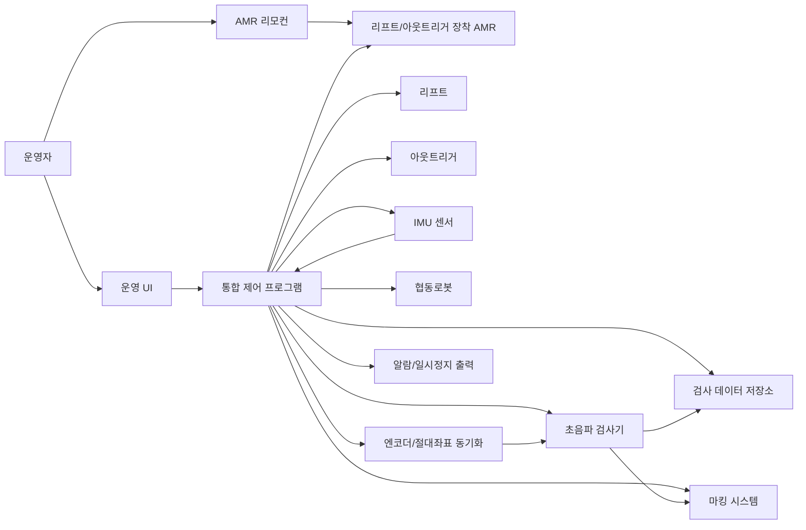

# 시스템 아키텍처

## 전체 구성

## 운용 구조

AMR은 목적지까지 리모컨으로 수동 이동한다. 목적지 도착 후에는 소형원자로 또는 기준 구조물을 기준으로 자동 원주 이동을 수행하며, 각 검사 위치에서 아웃트리거 전개와 IMU 기반 수평 보정을 완료한 뒤 협동로봇 검사를 수행한다.

## 하드웨어 구성

| 장치 | 역할 | 주요 확인 항목 |
| --- | --- | --- |
| AMR | 목적지 수동 이동, 검사 위치 간 자동 원주 이동 | 수동/자동 모드 전환, 위치 정확도, 장애물 회피 |
| 리프트 | 검사 높이 조정 | 하중, 높이 범위, 반복정밀도 |
| 아웃트리거 | 검사 중 본체 고정 및 수평 보정 | 접지 상태, 스트로크, 하중, 제어 정밀도 |
| IMU 센서 | 본체 roll, pitch, yaw 및 진동 확인 | 정확도, 필터링, 안정화 시간 |
| 협동로봇 | 프로브 위치 및 자세 제어 | 작업 반경, TCP 정밀도, 힘 제어, IP65, 최대 주사속도 150 mm/s 이상 |
| 초음파 검사기 | UT 신호 취득 | 채널 수, 샘플링, 파일 포맷 |
| 프로브/커플런트 | 검사 접촉 품질 확보 | 접촉력, 마모, 공급 방식 |
| 안전 펜스/접근 센서 | 로봇 작업 반경 접근 감지 | 이동/분할/고정 구조, 접근 시 일시정지 |
| 마킹 시스템 | UT 기준 초과 위치 표시 | Paint Spray 트리거, UT 신호 연동 |

## 소프트웨어 구성

| 모듈 | 역할 |
| --- | --- |
| 장비 연동 모듈 | AMR, 리프트, 아웃트리거, IMU, 로봇, UT 장비와 통신 |
| 시퀀스 제어 모듈 | 수동 이동 이후 자동 검사 절차를 단계별로 실행 |
| 수평 보정 모듈 | IMU 값을 기반으로 아웃트리거 보정 명령 생성 |
| 원주 이동 모듈 | 소형원자로 기준 다음 검사 위치로 AMR 자동 이동 |
| 좌표 동기화 모듈 | 협동로봇, 리프트, AGV 위치를 엔코더 기준 3D 절대좌표로 동기화 |
| 마킹/알람 모듈 | UT 기준 초과 신호, 이상 동작, 충돌 위험 알람 출력 |
| 경로 관리 모듈 | 로봇 스캔 경로와 검사 좌표 관리 |
| 데이터 수집 모듈 | UT 데이터 파일 및 메타데이터 저장 |
| 운영 UI | 검사 실행, 상태 확인, 알람 확인 |
| 로그/리포트 모듈 | 작업 로그, 검사 결과 요약 생성 |

## 제어 상태

| 상태 | 설명 |
| --- | --- |
| Idle | 대기 상태 |
| ManualMove | 리모컨 기반 AMR 수동 이동 |
| Prepare | 검사 계획 및 장비 상태 확인 |
| ReferenceDetect | 소형원자로 또는 기준 구조물 위치 확인 |
| OutriggerDeploy | 아웃트리거 전개 |
| LevelCheck | IMU 기반 본체 수평 확인 |
| LevelAdjust | 아웃트리거 기반 본체 수평 보정 |
| InspectionReady | 검사 가능 상태 |
| RobotInspection | 협동로봇 기반 초음파 검사 수행 |
| RobotRetract | 협동로봇 안전 위치 후퇴 |
| OutriggerRetract | 아웃트리거 회수 또는 이동 가능 상태 전환 |
| AutoIndexMove | 다음 검사 위치로 자동 원주 이동 |
| Pause | 일시정지 |
| Error | 오류 발생 |
| EmergencyStop | 비상정지 |
| Complete | 검사 완료 |

## 주요 설계 원칙

- 수동 이동 구간과 자동 검사 구간을 명확히 구분한다.
- 협동로봇 검사 중 AMR 주행 명령과 아웃트리거 회수 명령은 차단한다.
- 장비별 제어 로직과 검사 시퀀스 로직을 분리한다.
- 검사 데이터, 장비 로그, IMU 수평 보정 로그는 동일 작업 ID로 연결한다.
- 협동로봇, 리프트, AGV 위치는 엔코더 또는 동기화 기준으로 3D 절대좌표화하여 UT 데이터와 연결한다.
- UT 기준 초과 신호 발생 시 마킹 시스템 트리거와 검사 데이터 위치를 함께 기록한다.
- 모든 자동 동작은 중지 가능한 상태로 설계한다.
- 실제 장비 연동 전 시뮬레이션 또는 더미 드라이버를 제공한다.
